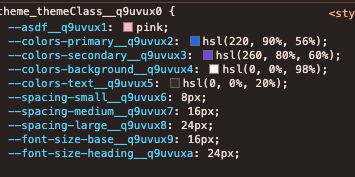
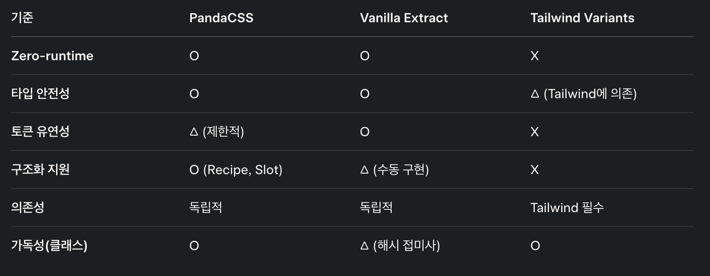

# PandaCSS

### 장점
- Recipe와 Slot 선언을 통해 컴포넌트 스타일을 체계적으로 관리 가능. 
- 디자인 시스템의 일관성을 유지하기에 매우 적함.
- 디자인 토큰 내장: panda.config에서 theme 객체를 통해 토큰(예: colors, spacing)을 정의하고, 이를 기반으로 스타일을 생성.
- Compound Variants 지원: 조건부 스타일링을 직관적으로 처리 가능.
  - 근데 경우의 수가 많아지면 단점으로 작용


### 단점
- 토큰 정의에 제약이 있음
  - theme 객체에서 커스텀 CSS 변수를 정의하려면 tokens에 추가해야 하지만, 미리 정의된 타입(colors, radii 등)에 제한됨. 
  - 자유로운 확장이 어려움.
- 현재는 panda에서 정의한 쳬게에 맞게 토큰을 생성하고, 해당 토큰들은 Vapor Token들을 바라보게 해결해두긴 함.
- 설정 복잡성이 매우 높음
  - panda.config.ts 파일 생성
  - styled-system 폴더 최신화
  - recipe, token 선언 파일들을 panda.config.ts 일일히 삽입

### 평가
PandaCSS는 구조화된 디자인 시스템에 강점을 가지지만, 토큰 정의의 유연성 부족과 설정 복잡성이 단점으로 작용. 특정 디자인 철학을 강요받는 느낌이 있음.


# Vanilla Extract

### 장점

- 설정 간소화 (확장자만 붙히면 됨)
- 자유로운 CSS 변수 정의: createTheme으로 CSS 변수를 자유롭게 정의 가능. 
- PandaCSS와 달리 theme 객체에 얽매이지 않음.

```
// theme.css.ts
import { createTheme } from '@vanilla-extract/css';

export const [themeClass, vars] = createTheme({
  colors: { primary: 'hsl(220, 90%, 56%)' },
  custom: { shadow: '0 4px 6px rgba(0, 0, 0, 0.1)' }, // 자유로운 정의
});

export const buttonStyle = style({
  backgroundColor: vars.colors.primary,
  boxShadow: vars.custom.shadow,
});
```

- @layer를 쉽게 삽입해 CSS 우선순위를 관리 가능.
  - @layer 이름도 커스텀 가능 
  -  


### 단점
- 해시 접미사(Hash Postfix): 클래스 이름과 CSS 변수에 해시가 붙어 가독성과 디버깅이 어려움(예: .buttonStyle__abc123).
  - css variable에도 붙음
  - **Custom Identifier**로 해결 가능하지만, 아직 실험적 기능.
  -  
- 플러그인 필요: vanillaExtractPlugin을 빌드 도구(Vite, Webpack 등)에 추가해야 함.
- Compound Variants 수동 구현: PandaCSS나 Tailwind Variants처럼 내장된 편의 기능이 없어 직접 조건부 로직 작성 필요.

### 평가
- Vanilla Extract는 유연성과 Zero-runtime으로 디자인 시스템에 적합하지만, 해시 접미사와 조건부 스타일링의 수동 구현이 불편함. 
- 최소 JS 환경에서도 클래스 접근이 어려운 점은 개선 필요.


# Tailwind Variants

### 장점
- ailwind 클래스와 결합해 컴포넌트 변형을 쉽게 정의.

```typescript
// button.ts
import { tv } from 'tailwind-variants';

export const button = tv({
  base: 'px-4 py-2 bg-blue-500 text-white',
  variants: {
    size: { small: 'text-sm', large: 'text-lg' },
  },
  compoundVariants: [
    { size: 'small', class: 'px-2' },
  ],
});
```
- Tailwind 생태계 활용: TailwindCSS 설치만으로 바로 사용 가능.
- Compound Variants 지원: 복잡한 조건부 스타일링을 간결하게 처리. (장점인가?)

### 단점
- TailwindCSS 의존성: Tailwind가 없으면 동작 불가. CSS 기술 선택의 자유를 제약.
- Utility-first 한계: 디자인 시스템의 구조화된 스타일링(예: Slot) 구현이 어려움.
- Zero-runtime 미지원: Tailwind 자체는 빌드 타임에 CSS를 생성하지만, 동적 스타일링은 런타임에 처리됨.

### 평가
Tailwind Variants는 Tailwind 사용자에게 편리하지만, 의존성으로 인해 독립적인 디자인 시스템 구축에는 부적합. Utility-first 접근은 대규모 시스템에서 일관성 유지가 어려울 수 있음.

# 종합평가

 